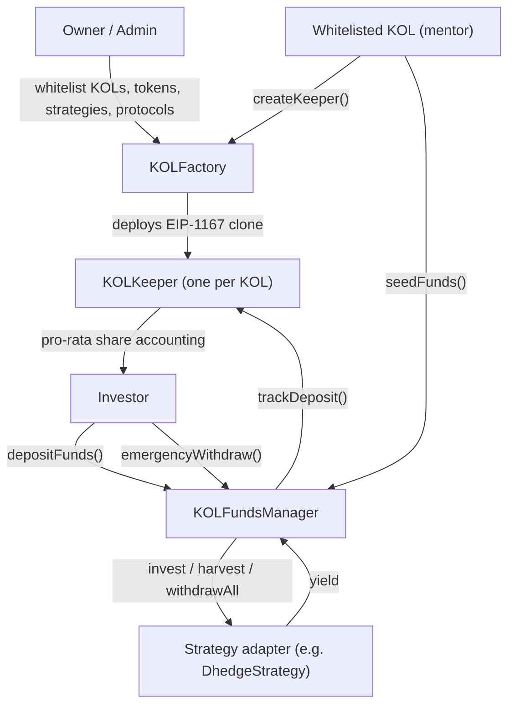

# Kollective

**On-chain, mentor-directed collective investing.**

Kollective is a Solidity smart-contract protocol that lets a curated set of **Key Opinion Leaders (KOLs / mentors)** manage pooled capital on behalf of everyday investors. Investors deposit into a KOL's on-chain pool; the KOL then allocates that pooled capital across a set of **admin-approved DeFi yield strategies**. Every investor's share of a pool is tracked transparently and pro-rata, custody is non-discretionary at the contract level, and the whole system is governed by an upgradeable factory with explicit whitelists.

The design goal is simple: give followers of a trusted strategist a **trust-minimized** way to invest alongside them — without handing over custody to an off-chain manager, and without the strategist being able to touch anything outside a pre-approved strategy set.

---

## Table of Contents

- [Why Kollective](#why-kollective)
- [How it works](#how-it-works)
- [Architecture](#architecture)
- [Roles & access control](#roles--access-control)
- [End-to-end lifecycle](#end-to-end-lifecycle)
- [Contracts in detail](#contracts-in-detail)
- [Tech stack](#tech-stack)
- [Repository structure](#repository-structure)
- [Getting started](#getting-started)
- [Deployment](#deployment)
- [Supported networks](#supported-networks)
- [Security model](#security-model)
- [Project status & roadmap](#project-status--roadmap)
- [Disclaimer](#disclaimer)
- [License](#license)

---

## Why Kollective

Retail investors often want to follow a strategist they trust, but the usual options are bad trade-offs: hand custody to an off-chain manager (trust + counterparty risk), or copy trades manually (slow, error-prone, no shared accounting).

Kollective puts that relationship on-chain with guardrails:

- **Non-custodial intent** — capital lives in protocol contracts, not in a KOL's personal wallet. A KOL can *allocate* funds across approved strategies but cannot withdraw them to an arbitrary address.
- **Bounded discretion** — KOLs can only route capital into strategies the protocol admins have whitelisted. New venues require governance approval, not just a KOL's say-so.
- **Transparent, pro-rata ownership** — each investor's share of a pool is computed on-chain from their deposits, so entitlements are always verifiable.
- **Per-KOL isolation** — every KOL gets their own keeper contract (a cheap minimal-proxy clone), so one mentor's pool is isolated from another's.
- **Upgradeable & gas-efficient** — UUPS proxies for core contracts; EIP-1167 clones for per-KOL keepers keep deployment costs low.

---

## How it works



At a glance:

1. **Admins** configure the protocol — they whitelist trusted KOLs, the tokens the protocol will accept, the strategy adapters capital may flow into, and approved external protocols.
2. A **whitelisted KOL** spins up their own pool by calling `createKeeper()` on the factory, which deploys a personal **KOLKeeper** clone (accepting 1–3 tokens).
3. **Investors** deposit accepted tokens into a KOL's pool through the **KOLFundsManager**, which custodies the capital and records each investor's stake on that KOL's keeper.
4. The **KOL** allocates available pooled capital across one or more whitelisted **strategy adapters** via `seedFunds()`.
5. **Strategy adapters** (e.g. a dHEDGE adapter) deploy capital into external DeFi venues to generate yield, and report back through the funds manager.
6. Investors can always reclaim their stake through `emergencyWithdraw()`.

---

## Architecture

| Contract | Type | Responsibility |
|---|---|---|
| **KOLFactory** | UUPS upgradeable proxy | Protocol registry & governance. Manages whitelists (KOLs, tokens, strategies, protocols), holds the keeper implementation, and deploys per-KOL keepers as clones. |
| **KOLKeeper** | EIP-1167 minimal-proxy clone (one per KOL) | Represents a single KOL's collective. Tracks per-investor deposits per token and computes each investor's pro-rata share of the pool. |
| **KOLFundsManager** | UUPS upgradeable proxy | Custodies pooled capital. Handles deposits, pool/invested accounting, KOL-directed allocation (`seedFunds`), and investor emergency withdrawals. |
| **KOLStrategyBase** | Abstract base | Common interface for strategy adapters (`invest` / `harvest` / `withdrawAll`), funds-manager gating, and ERC-1155 receiver hooks. |
| **DhedgeStrategy** | UUPS upgradeable adapter | Concrete strategy adapter scaffolding for dHEDGE integration. |
| **MUSDC** | Mock ERC-20 | Test stablecoin used for local/testnet flows. |
| **interfaces/** | Interfaces | `IKOLFactory`, `IKOLKeeper` — the cross-contract surfaces used for role checks and deposit tracking. |

**Design choices worth noting**

- **Factory + clones:** the factory deploys a single `KOLKeeper` implementation once, then stamps out cheap EIP-1167 clones per KOL. Each clone is initialized with its accepted tokens, creator (the KOL), factory, and funds manager.
- **Centralized custody, decentralized accounting:** capital pools in the funds manager, but ownership is tracked per-investor on each keeper, so accounting stays isolated per KOL while custody logic stays in one auditable place.
- **Separation of concerns:** governance (factory) ↔ accounting (keeper) ↔ custody/allocation (funds manager) ↔ execution (strategy adapters) are cleanly separated, each with a narrow role-gated surface.

---

## Roles & access control

| Role | Granted by | Can do |
|---|---|---|
| **Owner** | Deployer (proxy owner) | Authorize upgrades, add/remove admins, set core references (keeper implementation, funds manager). |
| **Admin** | Owner | Manage whitelists: KOLs, accepted tokens, strategies, protocols. |
| **KOL (mentor)** | Admin (whitelist) | Create their own keeper, and `seedFunds` from **their own** pool into whitelisted strategies. |
| **Investor** | Permissionless | Deposit into any KOL's pool; emergency-withdraw their own funds. |
| **Funds Manager** | Wiring | The only address allowed to call a keeper's `trackDeposit` / `trackWithdrawal` accounting hooks. |

Key guardrails enforced in code:

- A KOL can only `seedFunds` from a keeper **they created** (`_isKeeperCreator` check).
- Allocations can only target **whitelisted** strategies, and total allocation can never exceed a pool's *available* (deposited − already-invested) balance.
- Keepers accept a fixed set of **1–3 tokens**, validated against the factory's accepted-token list at creation.
- Only the funds manager can mutate a keeper's deposit accounting.

---

## End-to-end lifecycle

```
1. Admin setup
   ├─ setKOLWhitelist(kol, true)
   ├─ setTokenAccepted(token, true)
   └─ setStrategyWhitelist(strategy, true)

2. KOL creates a pool
   └─ KOLFactory.createKeeper("alpha", [USDC])  ──► deploys KOLKeeper clone

3. Investor deposits
   └─ KOLFundsManager.depositFunds(USDC, amount, keeper)
        ├─ pulls USDC from investor  (safeTransferFrom)
        ├─ updates pool accounting
        └─ keeper.trackDeposit(...)  ──► records investor's share

4. KOL allocates capital
   └─ KOLFundsManager.seedFunds(keeper, USDC, [strategyA, strategyB], [amtA, amtB])
        ├─ verifies caller is keeper creator
        ├─ verifies strategies are whitelisted
        └─ marks funds as invested

5. Strategy execution  (see Roadmap)
   └─ invest / harvest / withdrawAll  ──► external DeFi venue (e.g. dHEDGE)

6. Investor exit
   └─ KOLFundsManager.emergencyWithdraw(keeper, USDC, amount)
```

---

## Contracts in detail

### KOLFactory
Registry and governance hub.

- **State:** KOL whitelist, admin set, accepted tokens, whitelisted strategies (with O(1) swap-and-pop removal), whitelisted protocols, keeper implementation, deployed keepers, funds-manager reference.
- **Key functions:** `initialize`, `createKeeper` (KOL-only), `setKOLWhitelist`, `setStrategyWhitelist`, `setTokenAccepted`, `setProtocolWhitelist`, `setAdmin`, `setFundsManager`, `setKeeperImplementation`.
- **Events:** `KeeperCreated`, `KOLWhitelisted`, `StrategyWhitelisted`, `TokenAccepted`, `ProtocolWhitelisted`, `AdminAdded`/`AdminRemoved`, `FundsManagerSet`.

### KOLKeeper
A KOL's individual collective; deployed as a minimal-proxy clone.

- **State:** name, factory reference, funds-manager reference, creator (the KOL), accepted tokens, `userTokenDeposits[user][token]`, `totalTokenDeposits[token]`.
- **Key functions:** `initialize`, `trackDeposit` / `trackWithdrawal` (funds-manager only), `getUserTokenPercentage` (pro-rata share), plus token/deposit view helpers.
- **Events:** `KeeperInitialized`, `FundsDeposited`, `FundsWithdrawn`.

### KOLFundsManager
Custody and allocation engine.

- **State:** factory & keeper references, `kollectiveFunds[keeper][token]` (total deposited), `investedFunds[keeper][token]` (allocated to strategies).
- **Key functions:** `depositFunds` (permissionless), `seedFunds` (KOL & keeper-creator only), `emergencyWithdraw` (investor), plus pool/available/invested view helpers.
- **Events:** `FundMeCalled`, `PoolCreated`, `PoolUpdated`, `FundsSeeded`, `EmergencyWithdrawal`, `TokensReceived`.

### KOLStrategyBase / DhedgeStrategy
Pluggable yield-strategy adapters.

- **Interface:** `invest(token, amount)`, `harvest(token)`, `withdrawAll(token)` — all funds-manager gated — plus `emergencyRecover` (owner) and ERC-1155 receiver hooks.
- **DhedgeStrategy:** a concrete adapter targeting dHEDGE. New venues are added by deploying additional adapters that extend `KOLStrategyBase` and whitelisting them in the factory.

---

## Tech stack

- **Solidity** `0.8.30` (optimizer enabled, 200 runs, `viaIR: true`)
- **OpenZeppelin Contracts / Contracts-Upgradeable** `^5.4.0` — `UUPSUpgradeable`, `OwnableUpgradeable`, `Clones` (EIP-1167), `SafeERC20`
- **Hardhat** `^2.26.1` with `hardhat-toolbox`, `@openzeppelin/hardhat-upgrades`, `hardhat-verify`, `hardhat-gas-reporter`, `hardhat-contract-sizer`
- **Solhint** for linting
- Upgrade pattern: **UUPS** for `KOLFactory`, `KOLFundsManager`, and strategy adapters; **EIP-1167 minimal proxies** for per-KOL keepers

---

## Repository structure

```
contracts/
  KOLFactory.sol            Registry, governance, keeper deployment
  KOLKeeper.sol             Per-KOL pool & pro-rata share accounting
  KOLFundsManager.sol       Custody, deposits, allocation, withdrawals
  KOLStrategyBase.sol       Abstract strategy adapter base
  MUSDC.sol                 Mock USDC for testing
  interfaces/
    IKOLFactory.sol
    IKOLKeeper.sol
  strategies/
    DhedgeStrategy.sol      dHEDGE strategy adapter
scripts/
  deploy.js                 Full protocol deployment + wiring
  deploy-musdc.js           Deploy mock USDC
  upgrade.js                UUPS upgrade helper
  verify.js                 Block-explorer verification
hardhat.config.js
DEPLOYMENT.md               Detailed deployment guide
.solhint.json
env.example
```

---

## Getting started

### Prerequisites

- Node.js **v20+**
- npm **v10+**
- Git

### Install

```bash
git clone https://github.com/rehanshamas/kollective.git
cd kollective
npm install
```

### Configure environment

```bash
cp env.example .env
```

Then set the values in `.env`:

```env
SEPOLIA_RPC_URL=https://sepolia.infura.io/v3/YOUR_PROJECT_ID
HOLESKY_RPC_URL=https://holesky.infura.io/v3/YOUR_PROJECT_ID
PRIVATE_KEY=your_private_key            # never commit this
ETHERSCAN_API_KEY=your_etherscan_api_key
REPORT_GAS=true
COINMARKETCAP_API_KEY=your_coinmarketcap_api_key
```

### Common tasks

```bash
npm run compile        # compile contracts
npm run test           # run the test suite
npm run test:gas       # tests with gas reporting
npm run coverage       # coverage report
npm run size           # contract size analysis
npm run lint           # Solhint
npm run lint:fix       # Solhint autofix
npm run node           # local Hardhat node
```

---

## Deployment

The deploy script provisions the whole protocol and wires the cross-contract references in order:

1. Deploy **DhedgeStrategy** implementation (for later cloning).
2. Deploy **KOLKeeper** implementation (for later cloning).
3. Deploy **KOLFactory** behind a UUPS proxy and initialize it.
4. Deploy **KOLFundsManager** behind a UUPS proxy and initialize it.
5. Wire references (e.g. `factory.setFundsManager(...)`) so the pieces can talk to each other.
6. Run initial configuration / sanity checks.

```bash
# Local
npm run deploy:local

# Testnets
npm run deploy:sepolia
npm run deploy:holesky

# Mock USDC (optional, for testing)
npm run deploy:musdc:sepolia

# Upgrades (UUPS)
npm run upgrade:sepolia

# Verify on block explorer
npm run verify:sepolia
```

See [`DEPLOYMENT.md`](./DEPLOYMENT.md) for the full guide, including RPC providers and per-network notes.

---

## Supported networks

| Network | Chain ID | Purpose |
|---|---|---|
| Hardhat (in-process) | 1337 | Local testing |
| Localhost | 1337 | Local node |
| Sepolia | 11155111 | Public testnet |
| Holesky | 17000 | Public testnet |
| Ethereum mainnet | 1 | Pre-configured but commented out — enable deliberately |

---

## Security model

- **Custody isolation:** investor capital is held by the funds manager, not by KOLs. A KOL's only spending power is `seedFunds`, which is constrained to whitelisted strategies and bounded by available pool balance.
- **Whitelist gating:** KOLs, tokens, strategies, and protocols must all be explicitly approved by admins before they can be used.
- **Creator-bound allocation:** a KOL can only direct funds from a keeper they themselves created.
- **Upgrade authorization:** UUPS `_authorizeUpgrade` is owner-gated on all upgradeable contracts.
- **Safe token handling:** all ERC-20 movements use OpenZeppelin `SafeERC20`.
- **Investor exit:** `emergencyWithdraw` lets investors reclaim their tracked balance.

> **Audit status:** this code has **not** been independently audited. Do not use it with real funds on mainnet without a professional audit and thorough testing.

If you discover a vulnerability, please disclose it responsibly to the security contact listed in the contract headers (`@custom:security-contact`) rather than opening a public issue.

---

## Project status & roadmap

Kollective is an active, evolving side project. The current state:

**Implemented and working**
- Factory governance: KOL / token / strategy / protocol whitelists, admin & owner roles.
- Per-KOL keeper deployment via EIP-1167 clones, with 1–3 accepted tokens.
- Investor deposits with on-chain custody and pro-rata share accounting.
- Pool vs. invested accounting and KOL-directed allocation bookkeeping (`seedFunds`).
- Investor `emergencyWithdraw`.
- UUPS upgradeability and a full deploy / upgrade / verify script set across local + testnets.

**In progress / planned**
- **Strategy execution layer:** `invest` / `harvest` / `withdrawAll` in the strategy adapters currently emit events as scaffolding; the live integration that moves capital into external venues (e.g. dHEDGE) and harvests yield is the next milestone.
- Movement of allocated capital from the funds manager into strategy adapters on `seedFunds`.
- Performance / management fee logic for KOLs.
- Expanded test coverage and a formal audit before any mainnet use.

---

## Disclaimer

This software is provided for research and development purposes. It is experimental, unaudited, and may contain bugs. Interacting with smart contracts carries financial risk, including total loss of funds. Nothing here is financial advice. Use at your own risk.

---

## License

The contracts are released under the **MIT License** (per the SPDX identifiers in each source file).
